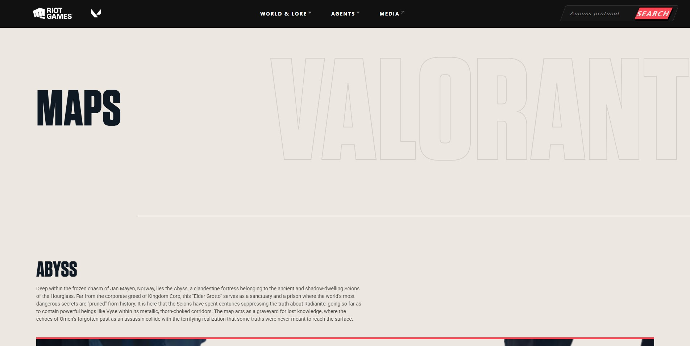
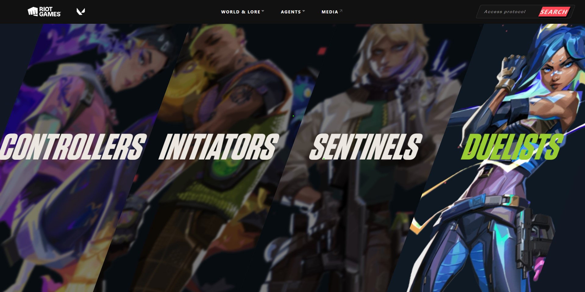
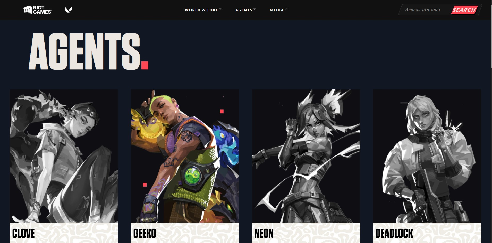
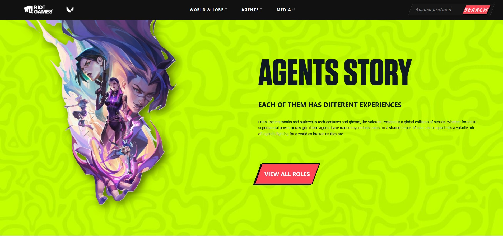

# VALORANT Lore & Agent Select Clone

An immersive web experience exploring the backstories and lore of VALORANT agents. (Mobile responsiveness currently in development.)

## Project Preview

  

  

  

##  Live Demo
You can view the live project here: [https://jankarl-web.github.io/valorant_lore/src/]

##  Features
* **Interactive Agent Cards:** Hover effects with custom sound triggers.
* **Dynamic Navigation:** Smooth transitions between Controllers, Initiators, Sentinels, and Duelists.
* **Authentic Design:** Uses game-accurate fonts, colors, and slanted "skew" containers.
* **Audio Integration:** Hover sounds for a more immersive experience. (not yet fixed)

## Tech Stack
* **HTML5:** Structured for semantic layouts.
* **CSS3:** Utilizing Flexbox, Skew transforms, and custom animations.
* **JavaScript:** Handling audio playback and interactive hover states

